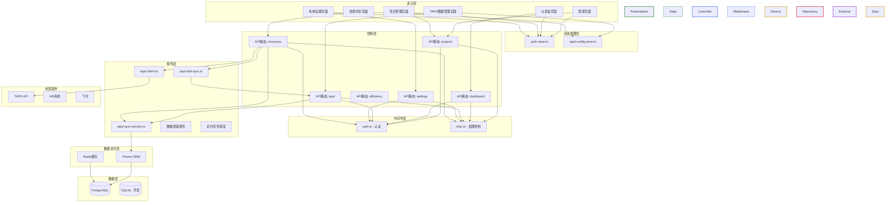

# 分层架构分析报告

---

## 一、分层架构图（Mermaid）



---

## 二、每层详细说明

### 1. 表示层（Presentation Layer）

**层的名称和职责**：负责用户界面展示和用户交互，包括页面渲染、表单处理、数据展示等。

**该层包含的核心模块**：
| 模块 | 文件路径 | 职责说明 |
|------|----------|----------|
| 登录页面 | `src/app/(auth)/login/page.tsx` | 用户登录认证界面 |
| 仪表盘 | `src/app/(dashboard)/dashboard/delivery-dashboard/page.tsx` | 交付数据可视化 |
| 项目管理 | `src/app/(dashboard)/projects/` | 项目列表、详情、管理 |
| TAPD数据管理 | `src/app/(dashboard)/tapd/data-manager/page.tsx` | TAPD数据查看和管理 |
| 系统设置 | `src/app/(dashboard)/settings/` | 团队配置、TAPD配置、项目映射 |
| 资源同步 | `src/app/(dashboard)/resources/sync/page.tsx` | 同步状态和日志查看 |

**该层对上层暴露的接口**：无（最顶层）

**该层依赖的下层**：
- 状态管理层（Zustand stores）
- 控制层（API路由）

---

### 2. 状态管理层（State Management）

**层的名称和职责**：管理应用全局状态，实现状态共享和响应式更新。

**该层包含的核心模块**：
| 模块 | 文件路径 | 职责说明 |
|------|----------|----------|
| 认证状态 | `src/stores/auth.store.ts` | 用户登录状态、角色信息 |
| TAPD配置状态 | `src/stores/tapd-config.store.ts` | TAPD认证配置、同步状态 |

**该层对上层暴露的接口**：
- `useAuthStore()` - 获取认证状态
- `useTapdConfigStore()` - 获取TAPD配置

**该层依赖的下层**：
- NextAuth（认证）
- API路由（数据获取）

---

### 3. 控制层（Controller Layer）

**层的名称和职责**：处理HTTP请求，执行认证授权，调用服务层，返回响应。

**该层包含的核心模块**：
| 模块 | 文件路径 | 职责说明 |
|------|----------|----------|
| 项目API | `src/app/api/v1/projects/` | 项目CRUD、汇总统计、里程碑、成本、ROI |
| 仪表盘API | `src/app/api/v1/dashboard/` | 交付数据查询 |
| TAPD API | `src/app/api/v1/tapd/` | TAPD工作空间、同步任务、数据查询 |
| 设置API | `src/app/api/v1/settings/` | 团队配置、项目映射、系统配置 |
| 资源API | `src/app/api/v1/resources/` | TAPD数据拉取、同步触发、状态查询 |

**该层对上层暴露的接口**：
- RESTful API端点（GET/POST/PUT/DELETE）

**该层依赖的下层**：
- 中间件层（认证、RBAC）
- 服务层（TAPD同步服务）
- 数据访问层（Prisma）

---

### 4. 中间件层（Middleware Layer）

**层的名称和职责**：处理请求预处理，包括认证验证、权限检查、请求日志等。

**该层包含的核心模块**：
| 模块 | 文件路径 | 职责说明 |
|------|----------|----------|
| 认证中间件 | `src/lib/middleware/auth.ts` | 用户认证验证，获取认证上下文 |
| RBAC中间件 | `src/lib/middleware/rbac.ts` | 角色权限检查，数据范围过滤 |

**该层对上层暴露的接口**：
- `requireAuth()` - 要求用户已认证
- `getAuthContext()` - 获取认证上下文
- `checkPermission(method, path, authCtx)` - 检查权限
- `getDataScopeFilter(authCtx)` - 获取数据范围过滤条件

**该层依赖的下层**：
- NextAuth（认证服务）
- Prisma（权限配置查询）

---

### 5. 服务层（Service Layer）

**层的名称和职责**：封装业务逻辑，协调数据访问，提供可复用的业务服务。

**该层包含的核心模块**：
| 模块 | 文件路径 | 职责说明 |
|------|----------|----------|
| TAPD同步服务 | `src/lib/sync/tapd-sync-service.ts` | TAPD数据全量同步、增量同步 |
| TAPD客户端 | `src/lib/sync/tapd-client.ts` | TAPD API封装、自动分页 |
| TAPD技能同步 | `src/lib/sync/tapd-skill-sync.ts` | 通过Skill Proxy调用TAPD |
| 数据质量服务 | `src/lib/sync/data-quality.ts` | 数据质量检查和修复 |
| 定时任务调度 | `src/lib/cron/scheduler.ts` | 定时同步任务调度 |

**该层对上层暴露的接口**：
- `fullSync(options)` - 全量同步TAPD数据
- `getLatestSyncRecord()` - 获取最近同步记录
- `getSyncHistory(limit)` - 获取同步历史
- `getRequirements(modifiedSince)` - 获取需求数据
- `getDefects(modifiedSince)` - 获取缺陷数据
- `getWorkHours(modifiedSince)` - 获取工时数据
- `getIterations()` - 获取迭代数据

**该层依赖的下层**：
- 数据访问层（Prisma ORM、Redis）
- 外部服务（TAPD API）

---

### 6. 数据访问层（Repository Layer）

**层的名称和职责**：提供数据持久化访问接口，封装数据库操作。

**该层包含的核心模块**：
| 模块 | 文件路径 | 职责说明 |
|------|----------|----------|
| Prisma ORM | `src/lib/prisma.ts` | PostgreSQL数据库访问，实体CRUD |
| Redis缓存 | `src/lib/redis.ts` | 缓存服务（当前为内存模拟） |

**该层对上层暴露的接口**：
- `prisma.project.findMany()` - 查询项目列表
- `prisma.project.create()` - 创建项目
- `prisma.tapdStory.upsert()` - 更新/创建TAPD需求
- `redis.get(key)` - 获取缓存
- `redis.set(key, value)` - 设置缓存

**该层依赖的下层**：
- 数据库（PostgreSQL）
- 缓存服务（Redis）

---

### 7. 外部服务层（External Services）

**层的名称和职责**：与外部系统交互，封装外部API调用。

**该层包含的核心模块**：
| 模块 | 职责说明 |
|------|----------|
| TAPD API | 腾讯敏捷协作平台，提供需求、任务、迭代、缺陷、工时数据 |
| HR系统 | 人员数据集成（待实现） |
| 飞书 | 企业IM集成（待实现） |

**该层对上层暴露的接口**：
- 通过TAPD客户端封装提供统一接口

**该层依赖的下层**：
- 外部API服务

---

## 三、跨层调用检测

### 检测结果

经过对代码的全面分析，**存在跨层调用问题**。

### 跨层调用位置列表

| 位置 | 调用路径 | 问题描述 | 影响 |
|------|----------|----------|------|
| `projects/route.ts` | Controller → Prisma | API路由直接调用prisma操作数据库 | 违反分层原则，难以测试和维护 |
| `projects/[id]/route.ts` | Controller → Prisma | API路由直接调用prisma操作数据库 | 同上 |
| `dashboard/delivery/route.ts` | Controller → Prisma | 仪表盘API直接调用prisma | 同上 |
| `tapd/sync/jobs/route.ts` | Controller → Prisma | 同步任务API直接调用prisma | 同上 |
| `tapd-sync-service.ts` | Service → Prisma | 服务层直接操作数据库 | 可接受（服务层职责） |

### 跨层调用影响分析

**问题1：Controller层直接访问DAO**

在多个API路由文件中，Controller直接调用`prisma`进行数据库操作：

```typescript
// src/app/api/v1/projects/route.ts
export async function GET(request: NextRequest) {
  const projects = await prisma.project.findMany({ ... });  // 直接访问
}
```

**影响**：
- 违反分层架构原则，导致代码耦合度高
- 难以进行单元测试（需要模拟prisma）
- 业务逻辑分散在Controller中，难以复用
- 不利于后续扩展（如需切换数据库）

**问题2：缺少Service层封装**

项目中虽然有`tapd-sync-service.ts`作为服务层，但项目管理相关的业务逻辑直接写在Controller中，没有对应的Service层。

### 优化建议

1. **引入Service层**：创建`ProjectService`、`DashboardService`等服务类封装业务逻辑
2. **依赖注入**：通过依赖注入方式提供Repository实例
3. **接口抽象**：定义Repository接口，降低耦合

---

## 四、设计模式识别

### 识别的设计模式列表

| 设计模式 | 应用位置 | 具体实现 |
|----------|----------|----------|
| **单例模式** | `src/lib/prisma.ts` | `globalForPrisma.prisma`确保全局唯一实例 |
| **单例模式** | `src/lib/sync/tapd-client.ts` | `clientInstance`确保Axios客户端唯一 |
| **工厂模式** | `src/lib/prisma.ts` | `createPrismaClient()`函数创建实例 |
| **代理模式** | `src/lib/middleware/auth.ts` | `requireAuth()`代理认证检查 |
| **代理模式** | `src/lib/middleware/rbac.ts` | `checkPermission()`代理权限检查 |
| **策略模式** | `src/lib/middleware/rbac.ts` | `ROLE_HIERARCHY`定义角色层级策略 |
| **观察者模式** | `src/stores/auth.store.ts` | Zustand状态订阅机制 |
| **模板方法模式** | `src/lib/sync/tapd-sync-service.ts` | `fullSync()`定义同步流程模板 |
| **适配器模式** | `src/lib/utils/api-response.ts` | 统一响应格式适配 |
| **建造者模式** | Prisma ORM | `prisma.project.create({ data: {...} })` |

### 模式详细说明

#### 1. 单例模式（Singleton）

**应用位置**：`src/lib/prisma.ts`

```typescript
const globalForPrisma = globalThis as unknown as {
  prisma: PrismaClient | undefined;
};

export const prisma = globalForPrisma.prisma ?? createPrismaClient();
```

**应用位置**：`src/lib/sync/tapd-client.ts`

```typescript
let clientInstance: AxiosInstance | null = null;

function getClient(): AxiosInstance {
  if (!clientInstance) {
    clientInstance = createTapdClient();
  }
  return clientInstance;
}
```

**目的**：确保全局只有一个数据库连接和HTTP客户端实例，避免资源浪费。

---

#### 2. 工厂模式（Factory）

**应用位置**：`src/lib/prisma.ts`

```typescript
function createPrismaClient() {
  const connectionString = process.env.DATABASE_URL;
  const adapter = new PrismaPg({ connectionString });
  return new PrismaClient({ adapter });
}
```

**目的**：封装对象创建逻辑，提供统一的创建入口，便于后续扩展（如切换数据库适配器）。

---

#### 3. 代理模式（Proxy）

**应用位置**：`src/lib/middleware/auth.ts`

```typescript
export async function requireAuth(): Promise<AuthContext> {
  const ctx = await getAuthContext();
  if (!ctx) throw forbidden('未认证');
  return ctx;
}
```

**应用位置**：`src/lib/middleware/rbac.ts`

```typescript
export async function checkPermission(method: string, path: string, authCtx?: AuthContext) {
  const ctx = authCtx || (await requireAuth());
  // 权限检查逻辑...
}
```

**目的**：在不修改原有方法的情况下，增加认证和权限检查功能。

---

#### 4. 策略模式（Strategy）

**应用位置**：`src/lib/middleware/rbac.ts`

```typescript
const ROLE_HIERARCHY: Record<string, number> = {
  EXECUTIVE: 1,
  HR: 2,
  PM: 3,
  LEADER: 4,
  MANAGER: 5,
  ADMIN: 6,
};

const API_PERMISSIONS: Record<string, RoleCheck> = {
  'GET /api/v1/projects': { allow: ['MANAGER', 'LEADER', 'PM'] },
  // ...
};
```

**目的**：将权限规则与检查逻辑分离，便于动态配置和扩展。

---

#### 5. 观察者模式（Observer）

**应用位置**：`src/stores/auth.store.ts`（Zustand状态管理）

```typescript
// Zustand内部实现观察者模式
const useAuthStore = create((set) => ({
  user: null,
  login: (userData) => set({ user: userData }),
  logout: () => set({ user: null }),
}));
```

**目的**：实现状态响应式更新，当状态变化时自动通知所有订阅组件。

---

#### 6. 模板方法模式（Template Method）

**应用位置**：`src/lib/sync/tapd-sync-service.ts`

```typescript
export async function fullSync(options: SyncOptions): Promise<SyncResult> {
  // 1. 创建同步记录（固定步骤）
  const record = await prisma.tapdSyncRecord.create({ ... });
  
  try {
    // 2. 获取项目名称（固定步骤）
    // 3. 逐项目拉取数据（固定步骤，具体实现可变）
    // 4. 更新同步记录（固定步骤）
  } catch {
    // 错误处理（固定步骤）
  }
}
```

**目的**：定义算法骨架，将某些步骤延迟到子类实现（或通过参数配置）。

---

#### 7. 适配器模式（Adapter）

**应用位置**：`src/lib/utils/api-response.ts`

```typescript
export function success<T>(data: T, status = 200) {
  const body: SuccessData<T> = {
    code: 0,
    message: 'success',
    data,
  };
  return NextResponse.json(body, { status });
}
```

**目的**：将不同的响应格式适配为统一格式，简化Controller代码。

---

#### 8. 建造者模式（Builder）

**应用位置**：Prisma ORM使用

```typescript
await prisma.project.create({
  data: {
    name: 'Project Name',
    code: 'P-001',
    milestones: {
      create: [...],
    },
    costs: {
      create: [...],
    },
  },
  include: {
    owner: true,
    team: true,
  },
});
```

**目的**：通过链式调用或配置对象逐步构建复杂对象。

---

## 五、架构评估与建议

### 架构优点

1. **分层清晰**：整体采用经典的N层架构，职责划分明确
2. **模块化设计**：各模块职责单一，便于维护和扩展
3. **中间件机制**：认证和权限控制通过中间件统一处理
4. **状态管理**：使用Zustand实现响应式状态管理
5. **数据库抽象**：使用Prisma ORM简化数据库操作

### 架构改进建议

| 问题 | 建议 | 优先级 |
|------|------|--------|
| Controller直接访问DAO | 引入Service层封装业务逻辑 | 高 |
| 缺少Repository抽象 | 定义Repository接口，解耦具体实现 | 中 |
| Redis实现不完善 | 替换为真实Redis客户端 | 中 |
| 缺少日志系统 | 完善日志记录和监控 | 低 |
| 错误处理不一致 | 统一错误处理中间件 | 中 |

### 代码优化建议

**1. 引入Service层**

```typescript
// src/lib/services/project.service.ts
export class ProjectService {
  async findMany(options: FindManyOptions) {
    return prisma.project.findMany(options);
  }
  
  async create(data: CreateProjectDto) {
    // 业务逻辑处理
    return prisma.project.create({ data });
  }
}
```

**2. 使用依赖注入**

```typescript
// src/lib/container.ts
export const container = {
  projectService: new ProjectService(),
  tapdSyncService: new TapdSyncService(),
};
```

**3. 统一错误处理**

```typescript
// src/lib/middleware/error-handler.ts
export async function errorHandler(
  fn: (request: NextRequest) => Promise<NextResponse>
) {
  try {
    return await fn(request);
  } catch (error) {
    // 统一错误处理逻辑
    return internalError();
  }
}
```

---

**分析时间**：2026-05-14  
**分析范围**：`d:\platform\efficiency-platform\src\*`