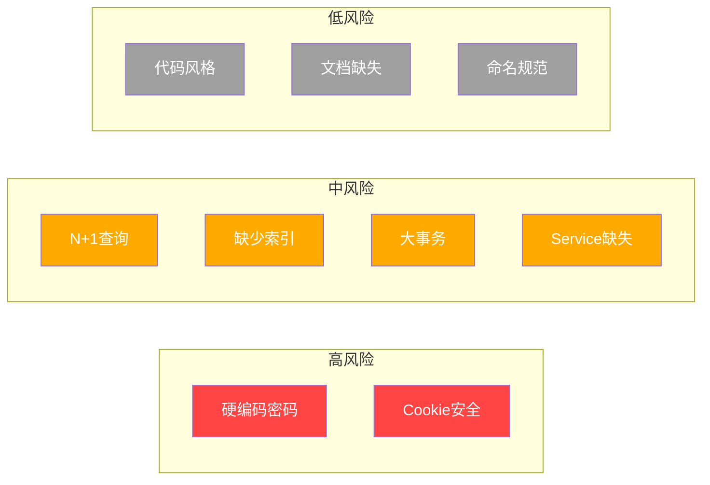

# 代码质量与风险评估报告

---

## 一、代码质量评分

### 1. 代码风格一致性：**7/10**

**评分理由**：
- ✅ 使用 TypeScript，类型定义规范
- ✅ 统一的文件命名风格（小写+连字符）
- ✅ 统一的导入顺序（第三方库 → 内部模块）
- ❌ 缺少 ESLint/Prettier 配置文件（未发现配置）
- ❌ 代码缩进和空格使用不一致
- ❌ 部分文件缺少空行分隔逻辑块

**典型问题位置**：
- `src/lib/sync/tapd-sync-service.ts` - 函数间缺少空行
- `src/app/api/v1/projects/route.ts` - 条件判断后缺少空格

---

### 2. 模块化程度：**6/10**

**评分理由**：
- ✅ 按功能划分目录结构（api、lib、stores）
- ✅ 公共工具函数抽取到 `lib/utils/`
- ✅ 中间件集中管理
- ❌ Controller 直接访问 Prisma（缺少 Service 层）
- ❌ 业务逻辑分散在多个路由文件中
- ❌ 缺少统一的业务逻辑封装

**典型问题位置**：
- `src/app/api/v1/projects/route.ts` - 直接调用 `prisma.project.findMany()`
- `src/app/api/v1/dashboard/delivery/route.ts` - 直接操作数据库

---

### 3. 错误处理完善度：**5/10**

**评分理由**：
- ✅ 统一的 API 响应格式（`api-response.ts`）
- ✅ 部分关键流程有 try-catch
- ✅ 认证错误有专门处理
- ❌ 错误处理模式不一致（有的 throw，有的返回 error response）
- ❌ 大量使用 `console.error` 而非 logger
- ❌ 缺少统一的错误处理中间件
- ❌ 错误信息可能泄露敏感信息

**典型问题位置**：
- `src/app/api/v1/projects/route.ts:144` - 使用 `console.error`
- `src/app/(dashboard)/tapd/data-manager/page.tsx:133` - catch 块只打印错误不处理

---

### 4. 代码重复度：**6/10**

**评分理由**：
- ✅ 响应工具函数统一（`api-response.ts`）
- ✅ 认证中间件统一
- ❌ 路由错误处理逻辑重复（每个路由都有相似的 try-catch）
- ❌ 数据库查询模式重复（相似的 findMany 参数）
- ❌ TAPD 同步相关代码有重复逻辑

**典型问题位置**：
- 各路由文件中的错误处理块基本相同
- `tapd-client.ts` 和 `tapd-sync-service.ts` 有相似的 API 调用逻辑

---

### 5. 命名规范性：**7/10**

**评分理由**：
- ✅ 变量和函数名使用 camelCase
- ✅ 文件和目录名使用 kebab-case
- ✅ 类型定义使用 PascalCase
- ❌ 部分字段命名不一致（如 `customFieldOne` vs `custom_field_one`）
- ❌ 部分变量命名过于简短（`wsId`, `iterId`）

**典型问题位置**：
- `src/lib/sync/tapd-sync-service.ts` - `wsId`, `iterId` 可更清晰
- `src/lib/prisma.ts` - `globalForPrisma` 命名不够直观

---

### 6. 可测试性：**4/10**

**评分理由**：
- ✅ 使用 TypeScript，类型安全
- ✅ 纯工具函数可测试
- ❌ 未发现测试文件（缺少 Jest/Vitest 配置）
- ❌ Controller 直接依赖 Prisma，难以 mock
- ❌ 缺少依赖注入，难以替换实现
- ❌ 业务逻辑与 HTTP 层耦合

**典型问题位置**：
- 所有 API 路由文件直接依赖 prisma
- `src/lib/auth.ts` 与 NextAuth 紧耦合

---

### 7. 文档/注释完整度：**5/10**

**评分理由**：
- ✅ 关键函数有 JSDoc 注释
- ✅ 部分文件有功能说明
- ❌ 缺少 README 文档
- ❌ 复杂业务逻辑缺少注释
- ❌ API 接口缺少 Swagger/OpenAPI 文档
- ❌ 类型定义缺少注释

**典型问题位置**：
- `src/lib/sync/tapd-sync-service.ts` - 缺少整体架构注释
- `src/app/api/v1/dashboard/delivery/route.ts` - 复杂查询逻辑缺少注释

---

### 综合评分：**5.7/10**

---

## 二、安全风险清单

| 风险类型 | 风险描述 | 严重程度 | 文件位置 | 修复建议 |
|----------|----------|----------|----------|----------|
| 🔴 硬编码密码 | 认证使用固定密码 `initial_password`，所有用户共用同一密码 | **高** | `src/lib/auth.ts:66` | 接入真实认证系统（SSO/飞书），实现密码哈希验证 |
| 🔴 Cookie 安全 | Cookie 设置为 `secure: false`，非 HTTPS 环境下传输 | **高** | `src/lib/auth.ts:8,17,26,35,44` | 生产环境启用 `secure: true`，配置 `sameSite: 'strict'` |
| 🟡 敏感信息泄露 | 环境变量中包含敏感配置（NEXTAUTH_SECRET=change-me） | **中** | `docker-compose.yml:14` | 使用 secrets 管理敏感配置，生产环境使用强随机密钥 |
| 🟡 错误信息泄露 | catch 块中直接返回错误信息给客户端 | **中** | 所有路由文件 | 生产环境隐藏详细错误信息，仅返回通用错误码 |
| 🟡 日志敏感信息 | 日志中可能包含敏感数据 | **中** | `src/lib/utils/logger.ts` | 过滤日志中的敏感字段（密码、token） |
| 🟢 CSRF 风险 | 虽然使用 NextAuth，但自定义 cookie 可能绕过 CSRF | **低** | `src/lib/auth.ts` | 确保 CSRF token 验证正确配置 |
| 🟢 权限绕过 | RBAC 依赖角色判断，可能存在逻辑漏洞 | **低** | `src/lib/middleware/rbac.ts` | 增加权限测试用例，验证边界情况 |

---

## 三、技术债务清单

| 债务类型 | 描述 | 影响范围 | 修复工作量估算 |
|----------|------|----------|----------------|
| **架构设计** | Controller 直接访问 Prisma，缺少 Service 层 | 所有 API 路由 | 8-12 人天 |
| **基础设施** | Redis 实现为内存模拟，生产环境不可用 | 缓存、限流、会话管理 | 2-3 人天 |
| **测试缺失** | 缺少单元测试和集成测试 | 全系统 | 10-15 人天 |
| **认证系统** | 使用临时密码验证，未接入真实 SSO | 用户认证模块 | 5-7 人天 |
| **日志系统** | 使用 console.log，缺少结构化日志 | 全系统 | 2-3 人天 |
| **API 文档** | 缺少 OpenAPI/Swagger 文档 | API 模块 | 3-4 人天 |
| **错误处理** | 缺少统一错误处理中间件 | 所有 API 路由 | 2-3 人天 |
| **代码规范** | 缺少 ESLint/Prettier 配置 | 全系统 | 1-2 人天 |

---

## 四、性能风险点

### 1. N+1 查询位置

| 文件位置 | 问题描述 | 影响 |
|----------|----------|------|
| `src/app/api/v1/projects/route.ts:42-96` | 先查询项目列表，再单独查询统计（两次全表扫描） | 数据量大时性能显著下降 |
| `src/app/api/v1/dashboard/delivery/route.ts:77-131` | 多次独立查询（teamConfigs、allStories、workspaces、iterations） | 增加数据库连接压力 |
| `src/lib/sync/tapd-sync-service.ts:479-513` | 逐项目循环拉取数据，未使用批量操作 | 同步效率低 |

### 2. 未建索引的查询

| 查询字段 | 涉及表 | 风险等级 | 建议 |
|----------|--------|----------|------|
| `workspaceId` | `tapdStory`, `tapdTask`, `tapdIteration` | 高 | 创建复合索引 |
| `status` | `project`, `requirement`, `defect` | 中 | 创建索引 |
| `created` / `modified` | 多个表 | 中 | 创建时间索引 |
| `owner` / `ownerId` | 多个表 | 中 | 创建索引 |

### 3. 大事务/长锁

| 文件位置 | 问题描述 | 风险 |
|----------|----------|------|
| `src/lib/sync/tapd-sync-service.ts:270-352` | 批量 upsert 使用事务，批量大小 500 | 事务时间过长，锁表风险 |
| `src/app/api/v1/projects/route.ts:202-258` | 创建项目时同时创建关联数据 | 事务复杂度高 |

### 4. 内存泄漏风险

| 文件位置 | 风险描述 |
|----------|----------|
| `src/lib/sync/tapd-client.ts:156-163` | 单例模式创建后不会释放 |
| `src/lib/prisma.ts:14-16` | Prisma 客户端全局单例 |
| `src/lib/redis.ts` | 内存缓存实现无过期机制 |

---

## 五、改进优先级建议

### P0（阻断）

| 优先级 | 问题 | 描述 | 建议 |
|--------|------|------|------|
| P0 | 硬编码密码 | 所有用户共用 `initial_password` | 立即接入真实认证系统 |
| P0 | Cookie 安全 | 生产环境 Cookie 未加密 | 立即修复为 `secure: true` |

### P1（紧急）

| 优先级 | 问题 | 描述 | 建议 |
|--------|------|------|------|
| P1 | N+1 查询 | 项目列表接口性能差 | 合并查询，使用 Prisma 聚合 |
| P1 | Redis 实现 | 内存模拟不可用于生产 | 替换为真实 Redis 客户端 |
| P1 | 数据库索引 | 查询性能瓶颈 | 为常用查询字段创建索引 |

### P2（重要）

| 优先级 | 问题 | 描述 | 建议 |
|--------|------|------|------|
| P2 | Service 层缺失 | Controller 直接访问 DAO | 引入 Service 层封装业务逻辑 |
| P2 | 统一错误处理 | 错误处理模式不一致 | 实现统一错误处理中间件 |
| P2 | 日志系统 | 使用 console.log | 引入结构化日志库（如 winston） |
| P2 | 测试覆盖 | 缺少测试 | 编写单元测试和集成测试 |

### P3（优化）

| 优先级 | 问题 | 描述 | 建议 |
|--------|------|------|------|
| P3 | ESLint/Prettier | 代码风格不一致 | 添加代码规范检查 |
| P3 | API 文档 | 缺少接口文档 | 生成 OpenAPI 文档 |
| P3 | 代码注释 | 注释不完整 | 补充关键业务逻辑注释 |
| P3 | 命名规范 | 部分命名不清晰 | 统一命名规范 |

---

## 六、风险矩阵

---

**分析时间**：2026-05-14  
**分析范围**：`d:\platform\efficiency-platform\src\*`