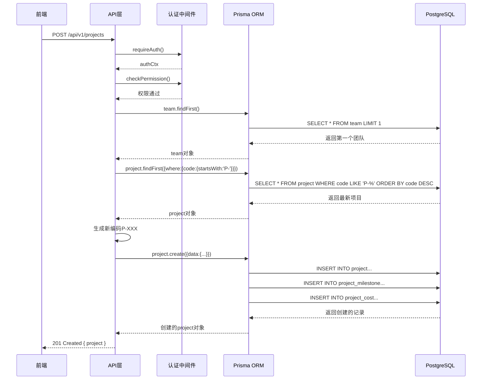
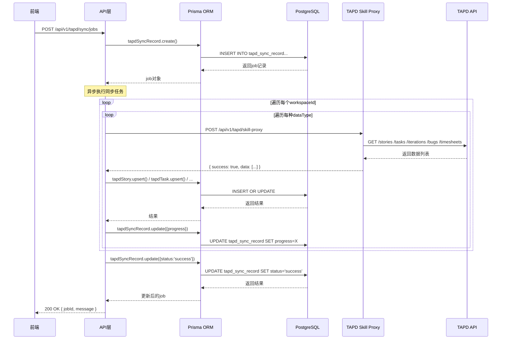
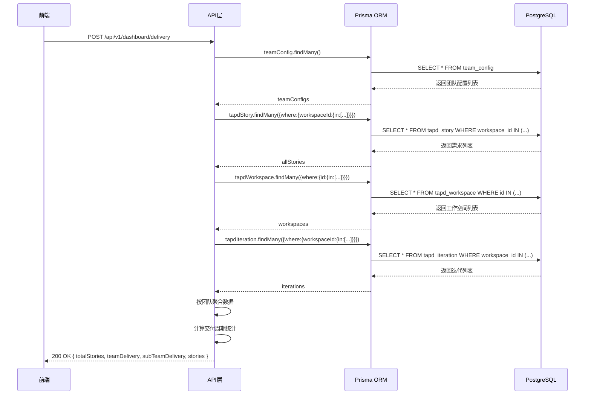

# 项目功能与数据模型深度分析报告

---

## 一、功能清单表

| 功能编号 | 功能名称（推测） | 对应端点/入口 | HTTP方法 | 鉴权级别 | 涉及的核心文件 |
|----------|------------------|---------------|----------|----------|----------------|
| F001 | 项目列表查询 | `/api/v1/projects` | GET | 需认证 | `projects/route.ts` |
| F002 | 创建项目 | `/api/v1/projects` | POST | 需认证 | `projects/route.ts` |
| F003 | 项目详情查询 | `/api/v1/projects/[id]` | GET | 需认证 | `projects/[id]/route.ts` |
| F004 | 更新项目 | `/api/v1/projects/[id]` | PUT | 需认证 | `projects/[id]/route.ts` |
| F005 | 删除项目 | `/api/v1/projects/[id]` | DELETE | 需认证 | `projects/[id]/route.ts` |
| F006 | 项目汇总统计 | `/api/v1/projects/summary` | GET | 需认证 | `projects/summary/route.ts` |
| F007 | 项目里程碑管理 | `/api/v1/projects/[id]/milestones` | GET/POST/PUT/DELETE | 需认证 | `projects/[id]/milestones/route.ts` |
| F008 | 项目成本管理 | `/api/v1/projects/[id]/costs` | GET/POST/PUT/DELETE | 需认证 | `projects/[id]/costs/route.ts` |
| F009 | 项目ROI分析 | `/api/v1/projects/[id]/roi` | GET | 需认证 | `projects/[id]/roi/route.ts` |
| F010 | 交付仪表盘 | `/api/v1/dashboard/delivery` | POST | 需认证 | `dashboard/delivery/route.ts` |
| F011 | TAPD工作空间查询 | `/api/v1/tapd/workspaces` | GET | 需认证 | `tapd/workspaces/route.ts` |
| F012 | TAPD同步任务管理 | `/api/v1/tapd/sync/jobs` | GET/POST | 需认证 | `tapd/sync/jobs/route.ts` |
| F013 | 同步任务状态查询 | `/api/v1/tapd/sync/jobs/[id]` | GET | 需认证 | `tapd/sync/jobs/[id]/route.ts` |
| F014 | TAPD数据统计 | `/api/v1/tapd/data/stats` | GET | 需认证 | `tapd/data/stats/route.ts` |
| F015 | TAPD数据查询 | `/api/v1/tapd/data/query` | POST | 需认证 | `tapd/data/query/route.ts` |
| F016 | TAPD技能代理 | `/api/v1/tapd/skill-proxy` | POST | 需认证 | `tapd/skill-proxy/route.ts` |
| F017 | 团队配置管理 | `/api/v1/settings/team-config` | GET/POST/PUT/DELETE | 需认证 | `settings/team-config/route.ts` |
| F018 | 项目映射配置 | `/api/v1/settings/project-mapping` | GET/POST/PUT/DELETE | 需认证 | `settings/project-mapping/route.ts` |
| F019 | 同步TAPD映射 | `/api/v1/settings/project-mapping/sync-tapd` | POST | 需认证 | `settings/project-mapping/sync-tapd/route.ts` |
| F020 | 系统配置管理 | `/api/v1/settings/system` | GET/POST | 需认证 | `settings/system/route.ts` |
| F021 | TAPD需求拉取 | `/api/v1/resources/tapd/fetch-stories` | POST | 需认证 | `resources/tapd/fetch-stories/route.ts` |
| F022 | TAPD任务拉取 | `/api/v1/resources/tapd/fetch-tasks` | POST | 需认证 | `resources/tapd/fetch-tasks/route.ts` |
| F023 | TAPD项目查询 | `/api/v1/resources/tapd/projects` | POST | 需认证 | `resources/tapd/projects/route.ts` |
| F024 | TAPD认证测试 | `/api/v1/resources/tapd/test-auth` | POST | 需认证 | `resources/tapd/test-auth/route.ts` |
| F025 | TAPD数据处理 | `/api/v1/resources/tapd/process-data` | POST | 需认证 | `resources/tapd/process-data/route.ts` |
| F026 | TAPD代理 | `/api/v1/resources/tapd/proxy` | POST | 需认证 | `resources/tapd/proxy/route.ts` |
| F027 | 同步状态查询 | `/api/v1/resources/sync/status` | GET | 需认证 | `resources/sync/status/route.ts` |
| F028 | 触发同步 | `/api/v1/resources/sync/trigger` | POST | 需认证 | `resources/sync/trigger/route.ts` |
| F029 | 同步日志查询 | `/api/v1/resources/sync/logs` | GET | 需认证 | `resources/sync/logs/route.ts` |
| F030 | 健康检查 | `/api/v1/health` | GET | 无需认证 | `health/route.ts` |

---

## 二、功能用户故事分析

### F001-F005 项目管理核心功能

- **作为** 项目管理者，**我希望** 能查询项目列表（支持筛选、分页、OKR分组视图），**以便** 快速了解所有项目的状态和进展
- **作为** 项目管理者，**我希望** 能创建新项目并自动生成项目编码，**以便** 规范项目管理流程
- **作为** 项目管理者，**我希望** 能查看单个项目的详细信息（包含里程碑、成本、ROI），**以便** 全面掌握项目情况
- **作为** 项目管理者，**我希望** 能更新项目信息和里程碑，**以便** 及时记录项目变更
- **作为** 项目管理者，**我希望** 能删除不再需要的项目，**以便** 保持项目列表整洁

### F006-F009 项目数据管理

- **作为** 项目经理，**我希望** 能查看项目汇总统计数据，**以便** 进行项目整体评估
- **作为** 项目经理，**我希望** 能管理项目里程碑（季度目标、达成率），**以便** 跟踪项目阶段性成果
- **作为** 财务人员，**我希望** 能管理项目成本（人力成本、基础设施成本、外部成本），**以便** 控制项目预算
- **作为** 管理层，**我希望** 能查看项目ROI分析数据，**以便** 评估项目投资回报率

### F010 交付仪表盘

- **作为** 团队负责人，**我希望** 能查看交付大盘数据（需求总数、人均交付量、交付周期），**以便** 评估团队交付效率

### F011-F016 TAPD数据同步与管理

- **作为** 系统管理员，**我希望** 能查询TAPD工作空间列表，**以便** 配置数据同步
- **作为** 系统管理员，**我希望** 能创建和管理TAPD同步任务，**以便** 定期同步需求、任务、迭代数据
- **作为** 系统管理员，**我希望** 能查看同步任务状态和历史记录，**以便** 监控同步进度
- **作为** 开发人员，**我希望** 能通过技能代理调用TAPD API，**以便** 灵活获取TAPD数据

### F017-F020 系统配置

- **作为** 系统管理员，**我希望** 能管理团队配置（TAPD项目映射、排名开关），**以便** 配置团队与TAPD项目的对应关系
- **作为** 系统管理员，**我希望** 能管理项目归属映射，**以便** 建立平台项目与TAPD项目的关联
- **作为** 系统管理员，**我希望** 能同步TAPD项目映射，**以便** 保持映射数据最新

### F021-F029 资源同步

- **作为** 数据工程师，**我希望** 能从TAPD拉取需求和任务数据，**以便** 进行数据分析
- **作为** 系统管理员，**我希望** 能测试TAPD认证配置，**以便** 确保同步功能正常
- **作为** 系统管理员，**我希望** 能手动触发数据同步，**以便** 在需要时更新数据

---

## 三、功能间依赖关系

### 前置条件关系

| 功能 | 前置依赖功能 | 依赖说明 |
|------|--------------|----------|
| F002 创建项目 | - | 无前置依赖 |
| F003-F005 项目详情/更新/删除 | F002 | 必须先创建项目 |
| F007-F009 里程碑/成本/ROI管理 | F002 | 必须先创建项目 |
| F012 创建同步任务 | F011 | 需先获取工作空间列表 |
| F016 TAPD技能代理 | - | 无前置依赖，但需正确配置TAPD认证 |
| F017 团队配置 | - | 无前置依赖 |
| F018 项目映射 | F002, F011 | 需要已有项目和TAPD工作空间 |
| F019 同步TAPD映射 | F018 | 需要已有项目映射配置 |
| F021-F024 TAPD数据拉取 | - | 需正确配置TAPD认证凭证 |

### 共享数据模型的功能组

#### 项目相关（共享 Project 模型）
- F001-F009 所有项目管理功能
- F010 交付仪表盘（间接关联）

#### TAPD同步相关（共享 TapdStory/TapdTask/TapdIteration/TapdBug/TapdTimesheet）
- F012-F016 TAPD同步任务管理
- F021-F026 TAPD资源拉取与处理
- F027-F029 同步状态与日志

#### 配置相关（共享 TeamConfig/SystemSetting/ProjectMapping）
- F017 团队配置
- F018-F019 项目映射
- F020 系统配置

---

## 四、未实现/已废弃功能

### 路由已定义但无处理函数

经检查API路由目录，所有路由文件均包含对应的HTTP方法处理函数，未发现空路由。

### 注释掉的代码块

在 `tapd/sync/jobs/route.ts` 中发现以下优化说明注释：
- 限流保护（每次请求间隔100ms）- 已实现
- 同步完整字段（包括自定义字段）- 已实现
- 使用fields参数优化数据传输 - 已实现
- 完善错误处理（status检查）- 已实现
- 添加工时数据同步 - 已实现
- extraData字段存储超出独立字段的自定义字段 - 已实现

**未发现明确废弃的功能代码。**

---

## 五、核心业务实体清单

| 实体名 | 核心字段（中文说明） | 关联实体 | 推测业务含义 |
|--------|----------------------|----------|--------------|
| **Organization** | id, name, parentId, level | Team, parent/children | 组织架构（部门/事业部/集团） |
| **Team** | id, name, orgId, leaderId, techStack | Organization, Member, Project | 团队信息 |
| **Member** | id, name, employeeNo, teamId, role, level, skills | Team, UserAccount, Project(owner), Requirement, Defect | 员工成员 |
| **Project** | id, name, code, type, priority, status, health, progress, ownerId, teamId, okrName, category | Team, Member(owner), ProjectOkr, ProjectCost, ProjectRoi, ProjectMilestone, Sprint, Defect, WorkHour | 项目主表 |
| **ProjectOkr** | id, projectId, okrCode, okrName, quarter, targetPercent, actualPercent | Project | 项目OKR关联 |
| **ProjectCost** | id, projectId, quarter, laborCost, infraCost, externalCost, totalCost | Project | 项目成本记录 |
| **ProjectRoi** | id, projectId, quarter, revenue, costSaving, efficiencyGain, totalBenefit, roiPercent | Project | 项目ROI分析 |
| **ProjectMilestone** | id, projectId, quarter, target, achievement, progress | Project | 项目季度里程碑 |
| **Sprint** | id, projectId, name, status, startDate, endDate, planCount, completedCount, healthScore | Project, Requirement, WorkHour, Defect | 迭代/冲刺 |
| **Requirement** | id, tapdId, sprintId, title, status, priority, complexity, assigneeId, leadTime, source | Sprint, Member | 需求/用户故事 |
| **WorkHour** | id, memberId, projectId, sprintId, date, hours, taskType, source | Member, Project, Sprint | 工时记录 |
| **Defect** | id, tapdId, projectId, sprintId, title, severity, status, reporterId, assigneeId, resolutionHours | Project, Sprint, Member | 缺陷/Bug |
| **UserAccount** | id, memberId, email, role, status, lastLogin | Member | 用户账号（认证） |
| **TapdStory** | id, name, status, priority, owner, creator, developer, workspaceId, iterationId, effort, completed, rawJson | - | TAPD需求原始数据 |
| **TapdTask** | id, name, status, priority, owner, storyId, workspaceId, iterationId, effort, progress, rawJson | - | TAPD任务原始数据 |
| **TapdIteration** | id, name, workspaceId, startDate, endDate, status, rawJson | - | TAPD迭代原始数据 |
| **TapdBug** | id, title, status, priority, severity, currentOwner, reporter, workspaceId, iterationId, rawJson | - | TAPD缺陷原始数据 |
| **TapdTimesheet** | id, entityType, entityId, timespent, spentdate, owner, workspaceId, rawJson | - | TAPD工时原始数据 |
| **TapdWorkspace** | id, name, status | - | TAPD工作空间 |
| **TapdSyncRecord** | id, syncType, workspaceIds, dataTypes, status, progress, storyCount, taskCount, bugCount, timesheetCount | - | TAPD同步记录 |
| **TeamConfig** | id, name, tapdProjectIds, enableTeamRanking, enableHrRanking | - | 团队配置 |
| **ProjectMapping** | id, projectId, tapdBelonging | Project | 项目归属映射 |
| **SystemSetting** | key, value, updatedAt | - | 系统配置（KV存储） |
| **SyncLog** | id, source, syncType, status, recordsCount, errorMessage, startedAt, finishedAt | - | 同步日志 |
| **AuditLog** | id, userId, action, resourceType, resourceId, detail, ipAddress, createdAt | - | 审计日志 |

---

## 六、实体关系图（Mermaid ER图）

```mermaid
erDiagram
    ORGANIZATION ||--o{ TEAM : contains
    TEAM ||--o{ MEMBER : has
    TEAM ||--o{ PROJECT : owns
    
    MEMBER ||--o{ USER_ACCOUNT : has
    MEMBER ||--o{ WORK_HOUR : logs
    MEMBER ||--o{ REQUIREMENT : assigned_to
    MEMBER ||--o{ DEFECT : reports
    MEMBER ||--o{ DEFECT : assigned_to
    MEMBER ||--o{ PROJECT : owns
    
    PROJECT ||--o{ PROJECT_OKR : has
    PROJECT ||--o{ PROJECT_COST : has
    PROJECT ||--o{ PROJECT_ROI : has
    PROJECT ||--o{ PROJECT_MILESTONE : has
    PROJECT ||--o{ SPRINT : has
    PROJECT ||--o{ DEFECT : contains
    PROJECT ||--o{ WORK_HOUR : has
    PROJECT ||--o{ PROJECT_MAPPING : mapped_to
    
    SPRINT ||--o{ REQUIREMENT : contains
    SPRINT ||--o{ WORK_HOUR : has
    SPRINT ||--o{ DEFECT : contains
    
    PROJECT_MAPPING }|--|| TAPD_WORKSPACE : maps_to
    
    TAPD_WORKSPACE ||--o{ TAPD_STORY : contains
    TAPD_WORKSPACE ||--o{ TAPD_TASK : contains
    TAPD_WORKSPACE ||--o{ TAPD_ITERATION : contains
    TAPD_WORKSPACE ||--o{ TAPD_BUG : contains
    TAPD_WORKSPACE ||--o{ TAPD_TIMESHEET : contains
    
    TAPD_STORY ||--o{ TAPD_TASK : has
    TAPD_ITERATION ||--o{ TAPD_STORY : contains
    
    TAPD_SYNC_RECORD }|--|| TAPD_WORKSPACE : syncs
    
    TEAM_CONFIG }|--|| TAPD_WORKSPACE : configures
```



---

## 七、从实体推测核心业务流程

基于数据模型设计，可推测以下核心业务流程：

### 1. 项目生命周期管理
```
创建项目 → 设置里程碑 → 分配负责人 → 记录成本 → 跟踪进度 → 完成/关闭项目
涉及实体: Project, ProjectMilestone, ProjectCost, Member
```

### 2. OKR对齐管理
```
创建项目 → 关联OKR → 设置季度目标 → 跟踪达成率 → 分析差距
涉及实体: Project, ProjectOkr, ProjectMilestone
```

### 3. TAPD数据同步
```
配置TAPD认证 → 选择工作空间 → 创建同步任务 → 拉取需求/任务/迭代 → 数据落库 → 更新同步记录
涉及实体: TapdSyncRecord, TapdStory, TapdTask, TapdIteration, TapdBug, TapdTimesheet
```

### 4. 迭代开发流程
```
创建迭代 → 分配需求 → 开发任务 → 记录工时 → 完成需求 → 关闭迭代
涉及实体: Sprint, Requirement, WorkHour, Member
```

### 5. 缺陷管理流程
```
发现缺陷 → 报告缺陷 → 分配处理 → 修复验证 → 关闭缺陷
涉及实体: Defect, Member
```

### 6. 成本核算流程
```
记录人力成本 → 记录基础设施成本 → 记录外部成本 → 汇总总成本 → ROI分析
涉及实体: ProjectCost, ProjectRoi
```

### 7. 团队配置与映射
```
创建团队 → 配置TAPD项目映射 → 设置排名开关 → 同步映射关系
涉及实体: Team, TeamConfig, ProjectMapping, TapdWorkspace
```

---

## 八、数据模型设计问题

### 1. 缺少索引的字段

| 实体 | 字段 | 建议 | 原因 |
|------|------|------|------|
| `Project` | `ownerId` | 添加索引 | 经常按负责人查询项目 |
| `Project` | `teamId` | 添加索引 | 经常按团队查询项目 |
| `Project` | `status` | 添加索引 | 经常按状态筛选 |
| `Project` | `category` | 添加索引 | 经常按分类筛选 |
| `Member` | `teamId` | 添加索引 | 经常按团队查询成员 |
| `Member` | `role` | 添加索引 | 经常按角色筛选 |
| `Requirement` | `status` | 添加索引 | 经常按状态查询 |
| `Requirement` | `assigneeId` | 添加索引 | 经常按负责人查询 |
| `Defect` | `severity` | 添加索引 | 经常按严重程度筛选 |
| `Defect` | `status` | 添加索引 | 经常按状态查询 |
| `WorkHour` | `memberId` | 添加索引 | 经常查询成员工时 |
| `WorkHour` | `date` | 添加索引 | 经常按日期范围查询 |

### 2. 冗余字段

| 实体 | 冗余字段 | 说明 |
|------|----------|------|
| `Project` | `progress` | 可由 milestones 的平均 progress 计算得出，代码中已有计算逻辑 |
| `ProjectCost` | `totalCost` | 可由 laborCost + infraCost + externalCost 计算得出 |
| `ProjectRoi` | `totalBenefit` | 可由 revenue + costSaving + efficiencyGain 计算得出 |

### 3. 不规范命名

| 实体 | 字段 | 问题 | 建议 |
|------|------|------|------|
| `TapdStory` | `custom_field_9` ~ `custom_field_20` | 命名不一致（部分用英文数字，部分用阿拉伯数字） | 统一使用 `custom_field_09` 格式或 `custom_field_nine` |
| `TapdTask` | `custom_field_9` ~ `custom_field_10` | 同上 | 同上 |
| `Project` | `po` | 缩写不明确 | 改为 `productOwner` 或添加注释说明 |
| `Member` | `level` | 字段名太笼统 | 改为 `memberLevel` 或 `grade` |
| `TapdStory` | `workspaceName` | 与 `workspace_id` 命名风格不一致 | 改为 `workspace_name` |

---

## 九、核心业务流程详细分析

### 流程1：项目创建流程

**流程名称**：项目创建与初始化

**触发条件**：用户在前端点击"创建项目"按钮并提交表单

**前置条件**：
- 用户已登录且具有创建项目权限
- 系统中至少存在一个团队（team）

**主流程步骤**：
1. 用户提交创建项目请求（POST /api/v1/projects）
2. 系统验证必填字段（name）
3. 系统自动获取或验证teamId
4. 系统自动生成项目编码（P-XXX格式）
5. 系统计算里程碑平均进度作为项目进度
6. 系统创建项目主记录
7. 系统创建关联的里程碑记录（如提供）
8. 系统创建关联的成本记录（如提供）
9. 返回创建成功的项目信息

**分支/异常流程**：
- 缺少name字段 → 返回400验证错误
- teamId无效或不存在 → 使用第一个团队作为默认值
- 项目编码重复 → 自动重新生成

**后置条件/输出**：
- Project记录已创建
- 关联的ProjectMilestone和ProjectCost记录已创建
- 返回包含项目详情和总成本的响应

**关键代码位置**：`src/app/api/v1/projects/route.ts` 第149-274行

---

### 流程2：TAPD数据同步流程

**流程名称**：TAPD需求/任务/迭代/缺陷/工时数据同步

**触发条件**：用户在前端点击"开始同步"按钮

**前置条件**：
- TAPD认证配置已正确设置
- 已选择至少一个工作空间
- 已选择至少一种数据类型
- 没有正在运行的同步任务

**主流程步骤**：
1. 用户提交同步请求（POST /api/v1/tapd/sync/jobs）
2. 系统验证参数（workspaceIds, dataTypes）
3. 系统检查是否有正在运行的任务
4. 系统创建同步任务记录（TapdSyncRecord）
5. 异步执行同步：
   - 遍历每个工作空间
   - 同步迭代数据（如选择）
   - 同步需求数据（如选择）
   - 同步任务数据（如选择）
   - 同步缺陷数据（如选择）
   - 同步工时数据（如选择）
   - 每步同步后更新进度
6. 同步完成后更新任务状态为success
7. 返回任务ID供前端查询状态

**分支/异常流程**：
- 参数验证失败 → 返回400错误
- 存在运行中任务 → 返回400错误（已有任务运行）
- TAPD API调用失败 → 记录错误信息，更新任务状态为failed

**后置条件/输出**：
- TapdSyncRecord状态更新为success或failed
- TapdStory/TapdTask/TapdIteration/TapdBug/TapdTimesheet记录已创建/更新
- 返回任务ID

**关键代码位置**：`src/app/api/v1/tapd/sync/jobs/route.ts` 第176-820行

---

### 流程3：交付仪表盘数据查询

**流程名称**：需求交付大盘数据查询

**触发条件**：用户访问交付仪表盘页面

**前置条件**：
- 用户已登录
- 已配置团队配置（TeamConfig）
- TAPD数据已同步到本地数据库

**主流程步骤**：
1. 用户提交查询请求（POST /api/v1/dashboard/delivery）
2. 系统验证参数（workspaceIds）
3. 系统获取团队配置（TeamConfig）
4. 系统从本地数据库查询需求数据（TapdStory）
5. 系统获取工作空间名称映射（TapdWorkspace）
6. 系统获取迭代名称映射（TapdIteration）
7. 系统按团队聚合需求数据
8. 系统计算子团队统计
9. 系统计算交付周期数据（平均周期、人均交付量等）
10. 组装并返回响应数据

**分支/异常流程**：
- 参数验证失败 → 返回400错误
- 数据库查询失败 → 返回500错误

**后置条件/输出**：
- 返回包含团队交付数据、子团队数据、需求列表、KPI指标的响应

**关键代码位置**：`src/app/api/v1/dashboard/delivery/route.ts` 第57-234行

---

### 流程4：项目里程碑管理流程

**流程名称**：项目里程碑更新与进度计算

**触发条件**：用户在项目详情页更新里程碑数据

**前置条件**：
- 用户已登录且具有项目修改权限
- 项目已存在

**主流程步骤**：
1. 用户提交更新请求（PUT /api/v1/projects/[id]）
2. 系统验证项目存在
3. 系统删除旧的里程碑记录
4. 系统创建新的里程碑记录
5. 系统重新计算项目进度（里程碑平均进度）
6. 系统更新项目主记录的progress字段
7. 返回更新后的项目信息

**分支/异常流程**：
- 项目不存在 → 返回404错误
- 里程碑数据格式错误 → 返回400错误

**后置条件/输出**：
- ProjectMilestone记录已更新
- Project.progress已更新
- 返回包含更新后里程碑和进度的项目信息

**关键代码位置**：`src/app/api/v1/projects/[id]/route.ts` 第48-180行

---

## 十、Mermaid时序图

### 时序图1：项目创建流程



### 时序图2：TAPD数据同步流程



### 时序图3：交付仪表盘数据查询



---

## 十一、总结

### 核心发现

1. **功能完整性**：项目覆盖了项目管理、TAPD数据同步、交付仪表盘、系统配置四大核心模块，功能较为完整

2. **架构设计**：采用Next.js App Router + Prisma ORM + PostgreSQL架构，遵循分层设计原则

3. **数据同步机制**：实现了完整的TAPD数据同步流程，支持需求、任务、迭代、缺陷、工时的同步

4. **性能优化**：交付仪表盘从本地数据库查询数据，避免实时调用TAPD API，响应更快

5. **数据模型问题**：存在索引缺失、冗余字段和命名不规范等问题，建议优化

### 建议改进

1. **索引优化**：为常用查询字段添加索引，提升查询性能
2. **冗余字段处理**：移除可计算字段，或改为数据库视图
3. **命名规范**：统一字段命名风格
4. **错误处理增强**：增加更详细的错误日志和监控
5. **缓存策略**：对静态配置数据增加Redis缓存

---

**分析时间**：2026-05-14  
**分析范围**：`d:\platform\efficiency-platform\src\app\api\v1\*`