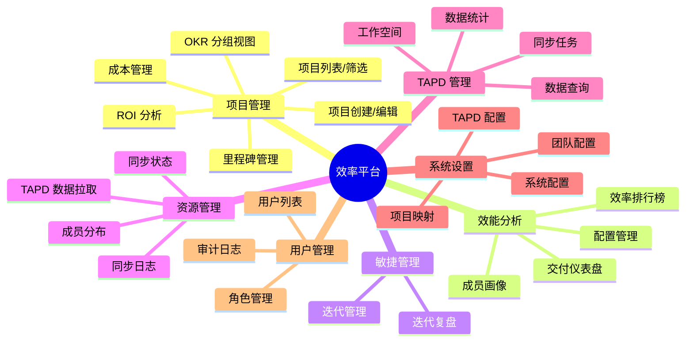
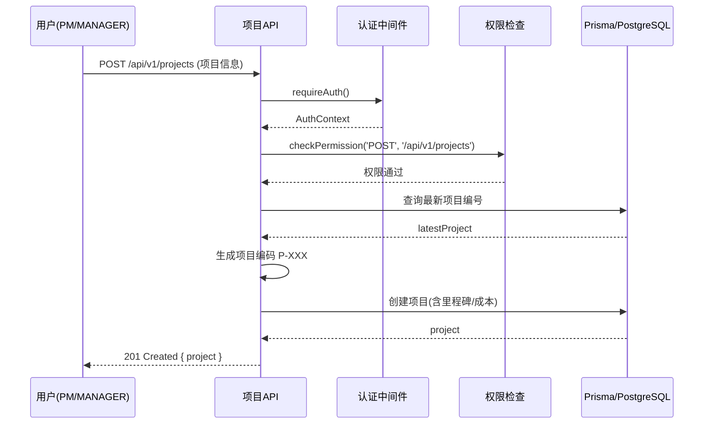
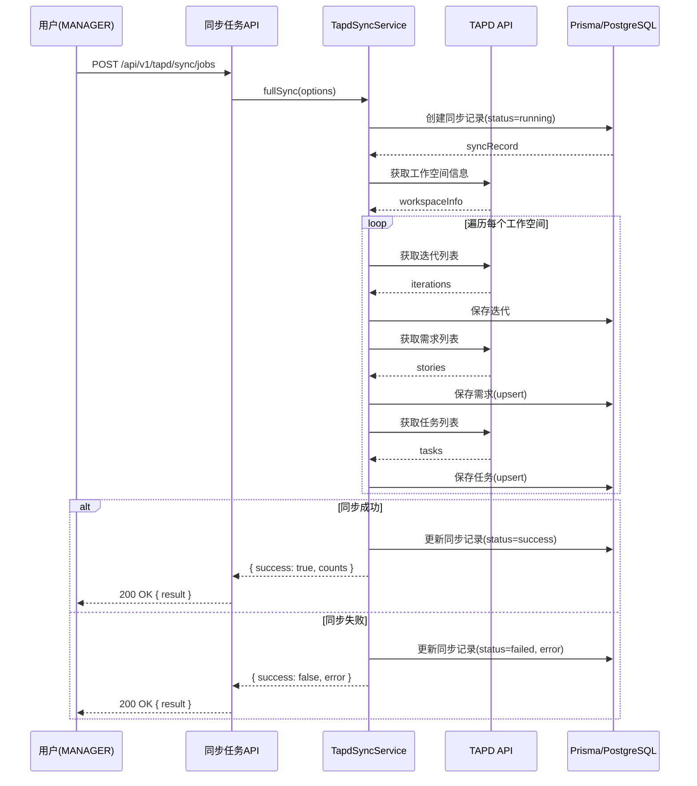
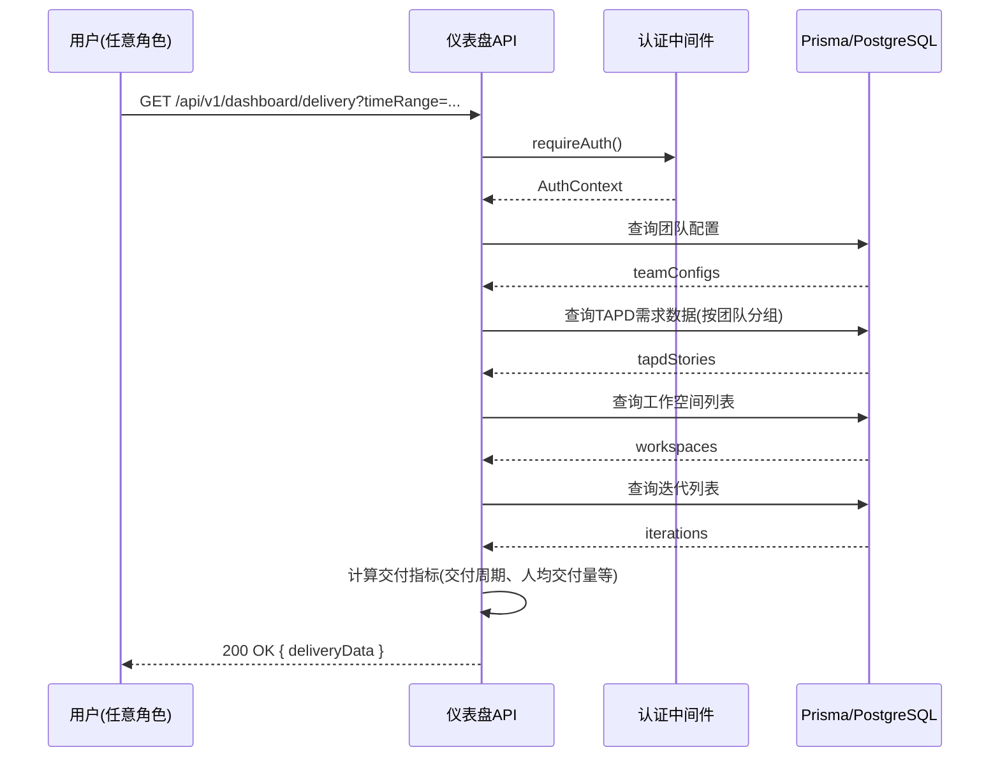

# 效率平台产品需求文档 (PRD)

---

## 1. 修订历史

| 版本 | 日期 | 作者 | 变更说明 |
|------|------|------|----------|
| v1.0 | 2026-05-14 | 系统分析 | 基于代码逆向分析生成初始版本 |

---

## 2. 项目背景

### 2.1 产品概述

**效率平台**是一款面向企业级用户的研发效能分析与项目管理系统，通过整合腾讯 TAPD 敏捷协作平台的数据，提供项目交付效率分析、资源利用率统计、成本效益评估等核心能力。系统采用 Next.js 14 + TypeScript 技术栈，支持多角色权限管理，为企业管理层、项目经理、团队负责人提供数据驱动的决策支持。

### 2.2 目标用户推测

| 用户角色 | 职责描述 | 典型需求 |
|----------|----------|----------|
| **管理层 (EXECUTIVE)** | 战略决策、资源配置 | 查看公司整体项目状态、效率排名、ROI 分析 |
| **项目经理 (PM)** | 项目全生命周期管理 | 创建项目、跟踪进度、成本控制、里程碑管理 |
| **团队负责人 (LEADER)** | 团队日常管理 | 团队成员绩效、任务分配、迭代管理 |
| **部门经理 (MANAGER)** | 部门资源协调 | 资源分布、成本预算、跨团队协作 |
| **HR 部门 (HR)** | 人员管理 | 员工技能评估、人员分布统计 |
| **系统管理员 (ADMIN)** | 系统配置维护 | 用户管理、系统设置、审计日志 |

### 2.3 核心价值主张

1. **数据集成**：无缝对接 TAPD，自动同步需求、任务、迭代、缺陷、工时数据
2. **效能分析**：多维度效率指标分析，可视化展示团队效能
3. **项目管理**：完整的项目生命周期管理，支持 OKR 对齐
4. **决策支持**：基于数据的智能洞察，辅助管理层决策
5. **权限管控**：细粒度的 RBAC 权限控制，保障数据安全

---

## 3. 系统功能架构

### 3.1 功能结构图

### 3.2 功能清单总表

| 功能编号 | 功能模块 | 功能名称 | 对应端点 | HTTP方法 | 涉及文件 |
|----------|----------|----------|----------|----------|----------|
| F001 | 项目管理 | 项目列表查询 | `/api/v1/projects` | GET | `src/app/api/v1/projects/route.ts` |
| F002 | 项目管理 | 项目创建 | `/api/v1/projects` | POST | `src/app/api/v1/projects/route.ts` |
| F003 | 项目管理 | 项目详情 | `/api/v1/projects/[id]` | GET | `src/app/api/v1/projects/[id]/route.ts` |
| F004 | 项目管理 | 项目更新 | `/api/v1/projects/[id]` | PUT | `src/app/api/v1/projects/[id]/route.ts` |
| F005 | 项目管理 | 项目删除 | `/api/v1/projects/[id]` | DELETE | `src/app/api/v1/projects/[id]/route.ts` |
| F006 | 项目管理 | 里程碑管理 | `/api/v1/projects/[id]/milestones` | GET/PUT | `src/app/api/v1/projects/[id]/milestones/route.ts` |
| F007 | 项目管理 | 成本管理 | `/api/v1/projects/[id]/costs` | GET/PUT | `src/app/api/v1/projects/[id]/costs/route.ts` |
| F008 | 项目管理 | ROI 分析 | `/api/v1/projects/[id]/roi` | GET/PUT | `src/app/api/v1/projects/[id]/roi/route.ts` |
| F009 | 项目管理 | 项目汇总 | `/api/v1/projects/summary` | GET | `src/app/api/v1/projects/summary/route.ts` |
| F010 | 效能分析 | 效率排行榜 | `/api/v1/efficiency/rankings` | GET | `src/app/api/v1/efficiency/rankings/route.ts` |
| F011 | 效能分析 | 交付仪表盘 | `/api/v1/dashboard/delivery` | GET | `src/app/api/v1/dashboard/delivery/route.ts` |
| F012 | 效能分析 | 成员画像 | `/api/v1/efficiency/members/[id]/profile` | GET | `src/app/api/v1/efficiency/members/[id]/profile/route.ts` |
| F013 | 敏捷管理 | 迭代列表 | `/api/v1/agile/sprints` | GET | `src/app/api/v1/agile/sprints/route.ts` |
| F014 | 敏捷管理 | 迭代复盘 | `/api/v1/agile/sprints/[id]/retro` | GET | `src/app/api/v1/agile/sprints/[id]/retro/route.ts` |
| F015 | 资源管理 | 成员分布 | `/api/v1/resources/members/distribution` | GET | `src/app/api/v1/resources/members/distribution/route.ts` |
| F016 | 资源管理 | TAPD 数据拉取 | `/api/v1/resources/tapd/fetch-stories` | POST | `src/app/api/v1/resources/tapd/fetch-stories/route.ts` |
| F017 | 资源管理 | 同步触发 | `/api/v1/resources/sync/trigger` | POST | `src/app/api/v1/resources/sync/trigger/route.ts` |
| F018 | 资源管理 | 同步日志 | `/api/v1/resources/sync/logs` | GET | `src/app/api/v1/resources/sync/logs/route.ts` |
| F019 | 资源管理 | 同步状态 | `/api/v1/resources/sync/status` | GET | `src/app/api/v1/resources/sync/status/route.ts` |
| F020 | TAPD 管理 | 工作空间列表 | `/api/v1/tapd/workspaces` | GET | `src/app/api/v1/tapd/workspaces/route.ts` |
| F021 | TAPD 管理 | 数据查询 | `/api/v1/tapd/data/query` | POST | `src/app/api/v1/tapd/data/query/route.ts` |
| F022 | TAPD 管理 | 数据统计 | `/api/v1/tapd/data/stats` | GET | `src/app/api/v1/tapd/data/stats/route.ts` |
| F023 | TAPD 管理 | 同步任务 | `/api/v1/tapd/sync/jobs` | GET/POST | `src/app/api/v1/tapd/sync/jobs/route.ts` |
| F024 | TAPD 管理 | 同步任务详情 | `/api/v1/tapd/sync/jobs/[id]` | GET/DELETE | `src/app/api/v1/tapd/sync/jobs/[id]/route.ts` |
| F025 | 系统设置 | 团队配置 | `/api/v1/settings/team-config` | GET/PUT | `src/app/api/v1/settings/team-config/route.ts` |
| F026 | 系统设置 | 项目映射 | `/api/v1/settings/project-mapping` | GET/PUT | `src/app/api/v1/settings/project-mapping/route.ts` |
| F027 | 系统设置 | 系统配置 | `/api/v1/settings/system` | GET/PUT | `src/app/api/v1/settings/system/route.ts` |
| F028 | 用户管理 | 用户列表 | `/api/v1/admin/users` | GET/POST | `src/app/api/v1/admin/users/route.ts` |
| F029 | 用户管理 | 审计日志 | `/api/v1/admin/audit-logs` | GET | `src/app/api/v1/admin/audit-logs/route.ts` |
| F030 | 认证授权 | 用户登录 | `/api/auth` | POST | `src/lib/auth.ts` |

---

## 4. 核心业务流程

### 4.1 项目创建流程

**流程描述**：
1. 用户通过前端表单提交项目创建请求
2. API 路由接收请求，先进行认证验证
3. 权限中间件检查用户是否有创建项目权限（PM/MANAGER）
4. 系统自动生成项目编码（格式：P-XXX）
5. 计算里程碑平均进度作为项目初始进度
6. 创建项目实体及其关联的里程碑和成本记录
7. 返回创建成功的项目信息

**异常流程**：
- 用户未认证 → 返回 401 未授权
- 用户无权限 → 返回 403 禁止访问
- 缺少必填字段（name）→ 返回 422 验证错误
- 数据库操作失败 → 返回 500 服务器错误

---

### 4.2 TAPD 数据同步流程

**流程描述**：
1. 用户触发 TAPD 数据同步任务
2. 同步服务创建同步记录，标记为运行中
3. 依次获取工作空间、迭代、需求、任务数据
4. 使用 upsert 方式批量保存到本地数据库
5. 更新同步记录状态（成功/失败）

**异常流程**：
- TAPD API 请求失败（429限流）→ 自动重试（最多3次）
- 网络超时 → 记录错误，标记同步失败
- 数据库写入失败 → 回滚事务，标记同步失败

---

### 4.3 交付仪表盘数据查询流程

**流程描述**：
1. 用户访问交付仪表盘页面
2. API 查询团队配置、需求数据、工作空间、迭代信息
3. 根据角色权限过滤数据范围
4. 聚合计算交付周期、人均交付量等 KPI
5. 返回可视化数据供前端渲染

**异常流程**：
- 数据量过大导致查询超时 → 返回部分数据或分页
- 无权限访问 → 返回 403 禁止访问

---

## 5. 功能需求详述

### 5.1 项目管理模块

#### F001 - 项目列表查询

| 属性 | 描述 |
|------|------|
| 功能编号 | F001 |
| 功能描述 | 支持分页、筛选、搜索、OKR分组视图的项目列表查询 |
| 使用角色 | MANAGER, LEADER, PM |
| 前置条件 | 用户已登录，具备查询权限 |
| 后置条件 | 返回项目列表及统计数据 |
| 业务流程 | 1. 用户进入项目列表页 2. 可选设置筛选条件 3. 发起查询 4. 展示结果 |
| 界面/交互 | 表格列表、筛选栏、搜索框、分页控件、统计卡片 |

#### F002 - 项目创建

| 属性 | 描述 |
|------|------|
| 功能编号 | F002 |
| 功能描述 | 创建新项目，支持批量创建里程碑和成本记录 |
| 使用角色 | MANAGER, PM |
| 前置条件 | 用户已登录，具备创建权限 |
| 后置条件 | 项目创建成功，生成唯一编码 |
| 业务流程 | 1. 用户进入创建页面 2. 填写项目信息 3. 添加里程碑/成本 4. 提交 |
| 界面/交互 | 表单页面、动态添加行、进度计算预览 |

#### F003 - 里程碑管理

| 属性 | 描述 |
|------|------|
| 功能编号 | F006 |
| 功能描述 | 查询和批量更新项目里程碑 |
| 使用角色 | MANAGER, PM |
| 前置条件 | 项目存在，用户有访问权限 |
| 后置条件 | 里程碑更新，项目进度自动计算 |
| 业务流程 | 1. 进入项目详情 2. 查看里程碑 3. 批量编辑 4. 保存 |
| 界面/交互 | 表格编辑、进度条显示、批量保存按钮 |

---

### 5.2 效能分析模块

#### F010 - 效率排行榜

| 属性 | 描述 |
|------|------|
| 功能编号 | F010 |
| 功能描述 | 按团队/个人展示效率排名 |
| 使用角色 | MANAGER, LEADER, HR |
| 前置条件 | 用户已登录，具备查看权限 |
| 后置条件 | 返回排名数据 |
| 业务流程 | 1. 进入排行榜页面 2. 选择排名维度 3. 查看排名 |
| 界面/交互 | 排行榜列表、筛选维度、图表展示 |

#### F011 - 交付仪表盘

| 属性 | 描述 |
|------|------|
| 功能编号 | F011 |
| 功能描述 | 展示项目交付数据可视化仪表盘 |
| 使用角色 | ADMIN, MANAGER, LEADER, PM, HR, EXECUTIVE |
| 前置条件 | 用户已登录 |
| 后置条件 | 返回仪表盘数据 |
| 业务流程 | 1. 进入仪表盘 2. 选择时间范围 3. 查看图表 |
| 界面/交互 | 多维度图表、时间筛选、数据钻取 |

---

### 5.3 TAPD 管理模块

#### F023 - 同步任务管理

| 属性 | 描述 |
|------|------|
| 功能编号 | F023 |
| 功能描述 | 创建和查询 TAPD 数据同步任务 |
| 使用角色 | MANAGER |
| 前置条件 | 用户已登录，具备同步权限 |
| 后置条件 | 同步任务创建/查询成功 |
| 业务流程 | 1. 进入同步管理页面 2. 创建或查看任务 3. 查看进度 |
| 界面/交互 | 任务列表、创建按钮、进度条、状态筛选 |

---

### 5.4 系统设置模块

#### F025 - 团队配置

| 属性 | 描述 |
|------|------|
| 功能编号 | F025 |
| 功能描述 | 管理团队基本配置信息 |
| 使用角色 | MANAGER |
| 前置条件 | 用户已登录，具备管理权限 |
| 后置条件 | 配置更新成功 |
| 业务流程 | 1. 进入系统设置 2. 编辑团队配置 3. 保存 |
| 界面/交互 | 表单编辑、保存按钮、配置项分组 |

---

## 6. 非功能需求

### 6.1 性能要求

| 指标 | 要求 | 说明 |
|------|------|------|
| API 响应时间 | ≤ 200ms（常规查询） | 复杂聚合查询 ≤ 1s |
| 同步效率 | 1000条记录/分钟 | TAPD数据同步 |
| 并发支持 | 100+ 并发用户 | 系统正常运行 |
| 数据分页 | 默认 20条/页，最大 100条/页 | 避免大数据量查询 |

### 6.2 安全要求

| 类别 | 要求 |
|------|------|
| 认证 | JWT Token 认证，会话有效期 24小时 |
| 权限 | RBAC 角色权限控制，细粒度资源访问 |
| 数据加密 | 传输层 HTTPS，敏感数据加密存储 |
| 审计 | 关键操作记录审计日志 |
| 防护 | 防止 SQL 注入、XSS 攻击、CSRF |

### 6.3 兼容性要求

| 类别 | 要求 |
|------|------|
| 浏览器 | Chrome ≥ 100, Firefox ≥ 95, Safari ≥ 15 |
| 设备 | 支持桌面端、平板端响应式布局 |
| 数据库 | PostgreSQL ≥ 14, SQLite（开发环境） |

---

## 7. 已知限制与技术债务

### 7.1 已知限制

| 限制项 | 描述 | 影响 |
|--------|------|------|
| 认证方式 | 仅支持临时密码验证，未接入 SSO | 生产环境不可用 |
| Redis 实现 | 内存模拟实现，生产环境不可用 | 缓存功能受限 |
| 数据同步 | 仅支持手动触发，无定时同步 | 数据实时性不足 |
| 外部集成 | 仅对接 TAPD，未集成 HR/飞书 | 数据来源单一 |

### 7.2 技术债务

| 债务类型 | 描述 | 工作量估算 |
|----------|------|------------|
| 架构设计 | Controller 直接访问 Prisma，缺少 Service 层 | 8-12 人天 |
| 测试缺失 | 缺少单元测试和集成测试 | 10-15 人天 |
| 认证系统 | 需要接入真实 SSO（飞书） | 5-7 人天 |
| 日志系统 | 使用 console.log，缺少结构化日志 | 2-3 人天 |
| API 文档 | 缺少 OpenAPI/Swagger 文档 | 3-4 人天 |

---

## 8. 后续迭代建议

### 8.1 短期目标（1-2 个月）

| 优先级 | 任务 | 描述 |
|--------|------|------|
| P0 | 认证改造 | 接入飞书 SSO，替换临时密码验证 |
| P0 | Redis 改造 | 替换为真实 Redis 客户端 |
| P1 | Service 层引入 | 封装业务逻辑，解耦 Controller 和 DAO |
| P1 | 数据库索引优化 | 为常用查询字段创建索引 |

### 8.2 中期目标（3-6 个月）

| 优先级 | 任务 | 描述 |
|--------|------|------|
| P1 | 定时同步 | 实现基于 cron 的自动同步机制 |
| P2 | HR 系统集成 | 对接企业 HR 系统，获取人员数据 |
| P2 | 移动端适配 | 优化移动端用户体验 |
| P2 | 报表导出 | 支持数据报表导出（Excel/PDF） |

### 8.3 长期目标（6 个月以上）

| 优先级 | 任务 | 描述 |
|--------|------|------|
| P3 | AI 智能分析 | 基于历史数据提供智能洞察建议 |
| P3 | 多系统集成 | 扩展支持 Jira、Azure DevOps 等平台 |
| P3 | 实时监控 | 实现项目健康度实时监控告警 |

---

**文档版本**：v1.0  
**生成日期**：2026-05-14  
**基于代码分析**：`d:\platform\efficiency-platform\`