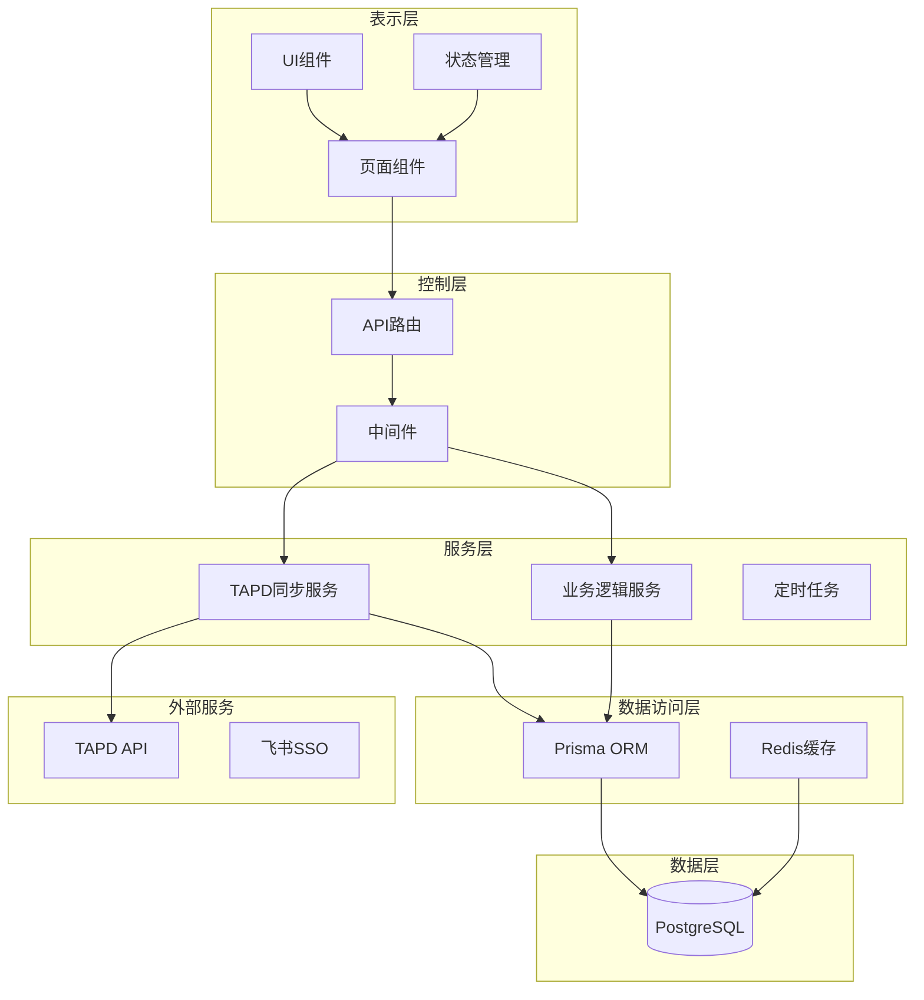
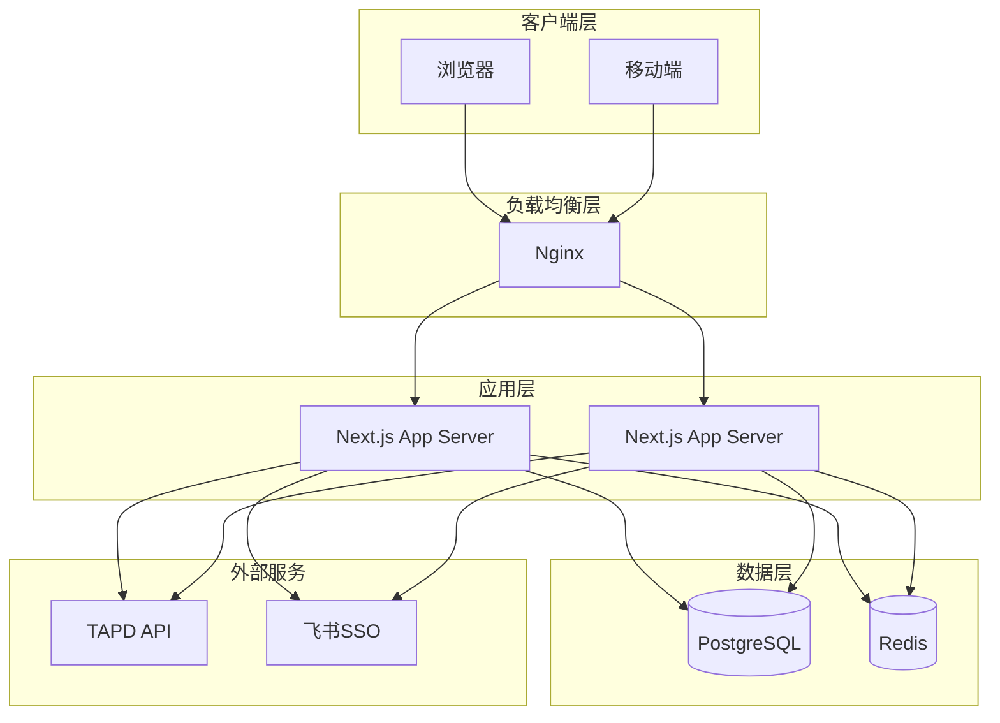
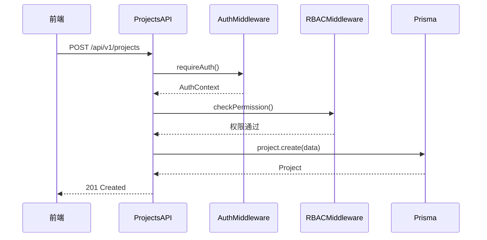
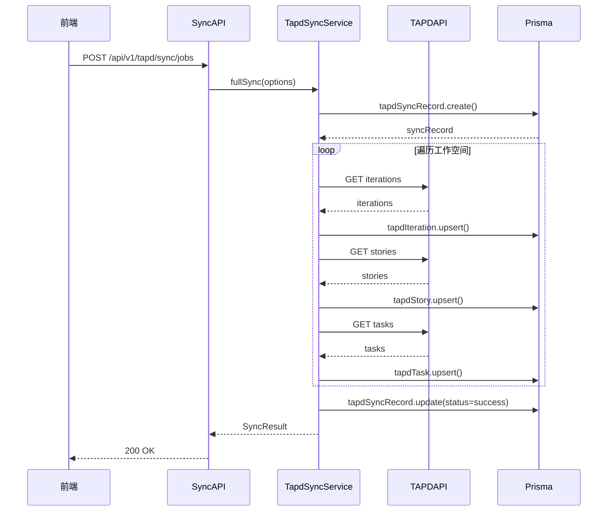
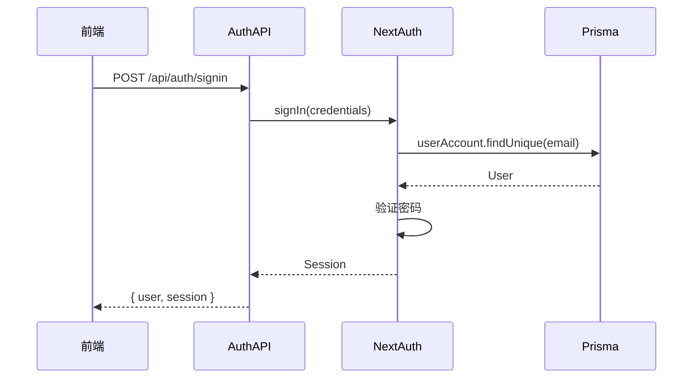
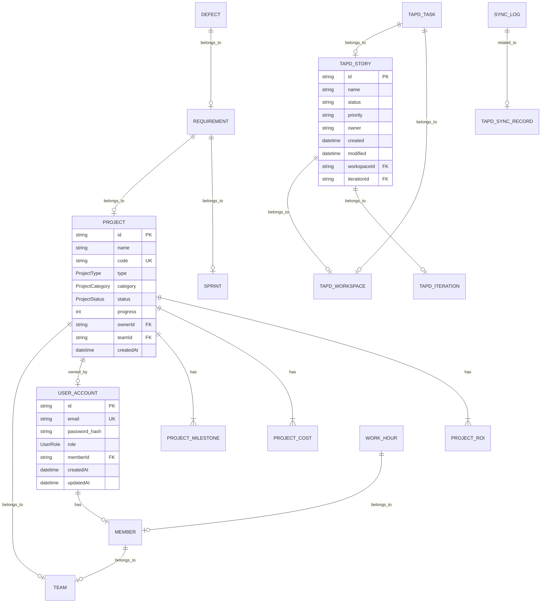

# 效率平台技术设计文档

---

## 1. 文档概述与范围

### 1.1 文档目的

本文档是效率平台的技术设计规范，旨在为开发团队提供完整的技术实现指南，包括系统架构、模块设计、数据结构、接口规范等核心内容。

### 1.2 适用范围

- **适用角色**：后端开发工程师、前端开发工程师、测试工程师、运维工程师
- **适用阶段**：项目开发、测试、部署、维护全生命周期
- **覆盖模块**：项目管理、效能分析、TAPD数据同步、系统设置、用户认证

### 1.3 文档约定

| 符号 | 含义 |
|------|------|
| `path/to/file.ts` | 文件路径 |
| `functionName()` | 函数/方法名 |
| `ClassName` | 类名 |
| `@param` | 函数参数 |
| `@returns` | 返回值 |

---

## 2. 技术栈说明

### 2.1 运行环境要求

| 环境 | 要求 |
|------|------|
| Node.js | ≥ 20.x |
| npm/yarn | ≥ 10.x |
| PostgreSQL | ≥ 14.x |
| Redis | ≥ 7.x（生产环境） |

### 2.2 核心技术选型及版本

| 分类 | 技术 | 版本 | 用途 |
|------|------|------|------|
| 框架 | Next.js | 14.x | Web应用框架 |
| 语言 | TypeScript | 5.x | 类型安全 |
| ORM | Prisma | 5.x | 数据库访问 |
| 认证 | NextAuth.js | 5.x | 用户认证 |
| UI | Ant Design | 5.x | 前端组件库 |
| 状态管理 | Zustand | 4.x | 全局状态 |
| 图表 | ECharts/Recharts | 最新 | 数据可视化 |

### 2.3 第三方依赖清单

| 依赖 | 版本 | 用途 |
|------|------|------|
| `axios` | 1.x | HTTP客户端 |
| `bcrypt` | 5.x | 密码哈希 |
| `jsonwebtoken` | 9.x | JWT处理 |
| `node-cron` | 3.x | 定时任务 |
| `zod` | 3.x | 数据验证 |
| `class-validator` | 0.14.x | 类验证器 |

---

## 3. 系统架构

### 3.1 分层架构图



### 3.2 部署架构图



### 3.3 各层职责说明

| 层级 | 职责 | 核心模块 |
|------|------|----------|
| **表示层** | 用户界面展示、交互处理、状态管理 | 页面组件、UI组件、Zustand stores |
| **控制层** | HTTP请求处理、参数校验、认证授权 | API路由、中间件(auth/rbac) |
| **服务层** | 业务逻辑封装、外部API调用、定时任务 | TAPD同步服务、业务服务、cron调度 |
| **数据访问层** | 数据库操作、缓存管理 | Prisma ORM、Redis客户端 |
| **数据层** | 数据持久化存储 | PostgreSQL数据库 |

---

## 4. 模块设计

### 4.1 项目管理模块

#### 模块概述
负责项目的CRUD操作，包括项目信息管理、里程碑管理、成本管理、ROI分析等功能。

#### 核心类/接口定义

```typescript
interface Project {
  id: string;
  name: string;
  code: string;
  type: ProjectType;
  category: ProjectCategory;
  status: ProjectStatus;
  health: ProjectHealth;
  progress: number;
  ownerId: string | null;
  teamId: string;
  // ... 其他字段
}

interface ProjectMilestone {
  id: string;
  projectId: string;
  quarter: string;
  target: string;
  achievement: string;
  progress: number;
}

interface ProjectCost {
  id: string;
  projectId: string;
  quarter: string;
  totalCost: number;
  target: string;
}
```

#### 时序图



---

### 4.2 TAPD同步模块

#### 模块概述
负责与TAPD平台的数据同步，包括需求、任务、迭代、缺陷、工时等数据的拉取和存储。

#### 核心类/接口定义

```typescript
interface SyncOptions {
  apiUser: string;
  apiPassword: string;
  workspaceIds: string[];
  createdBegin?: string;
  createdEnd?: string;
  onProgress?: (msg: string, percent: number) => void;
}

interface SyncResult {
  success: boolean;
  storyCount: number;
  taskCount: number;
  iterationCount: number;
  error?: string;
}

interface TapdRequirement {
  id: string;
  name: string;
  status: string;
  priority: string;
  owner: string;
  created: string;
  modified: string;
  workspace_id: string;
  iteration_id: string;
}
```

#### 时序图



---

### 4.3 认证授权模块

#### 模块概述
负责用户认证和权限管理，基于NextAuth实现JWT认证，配合RBAC进行细粒度权限控制。

#### 核心类/接口定义

```typescript
interface AuthContext {
  userId: string;
  email: string;
  role: UserRole;
  memberId?: string;
  teamId?: string;
}

type UserRole = 'ADMIN' | 'MANAGER' | 'LEADER' | 'PM' | 'HR' | 'EXECUTIVE';

interface PermissionRule {
  allow?: string[];
  minRole?: string;
}
```

#### 时序图



---

## 5. 数据设计

### 5.1 ER图



### 5.2 核心表结构说明

| 表名 | 用途 | 核心字段 |
|------|------|----------|
| `UserAccount` | 用户账户信息 | id, email, password_hash, role, memberId |
| `Member` | 员工信息 | id, name, userId, teamId, role |
| `Team` | 团队信息 | id, name, description |
| `Project` | 项目信息 | id, name, code, type, status, progress, ownerId, teamId |
| `ProjectMilestone` | 项目里程碑 | id, projectId, quarter, target, achievement, progress |
| `ProjectCost` | 项目成本 | id, projectId, quarter, totalCost |
| `TapdStory` | TAPD需求 | id, name, status, priority, owner, workspaceId, iterationId |
| `TapdTask` | TAPD任务 | id, name, status, owner, storyId, workspaceId |
| `TapdIteration` | TAPD迭代 | id, name, status, startDate, endDate, workspaceId |
| `TapdSyncRecord` | 同步记录 | id, syncType, status, storyCount, taskCount, errorMsg |
| `SyncLog` | 同步日志 | id, syncRecordId, message, level, createdAt |

### 5.3 索引策略

| 表名 | 字段 | 索引类型 | 理由 |
|------|------|----------|------|
| `UserAccount` | email | UNIQUE | 登录查询 |
| `Project` | code | UNIQUE | 项目编码唯一 |
| `Project` | teamId | INDEX | 按团队查询 |
| `Project` | status | INDEX | 按状态筛选 |
| `TapdStory` | workspaceId | INDEX | 按工作空间查询 |
| `TapdStory` | status | INDEX | 按状态统计 |
| `TapdStory` | iterationId | INDEX | 按迭代查询 |
| `TapdTask` | storyId | INDEX | 关联需求查询 |
| `TapdTask` | workspaceId | INDEX | 按工作空间查询 |
| `TapdSyncRecord` | status | INDEX | 状态筛选 |
| `TapdSyncRecord` | startedAt | INDEX | 时间范围查询 |

### 5.4 数据迁移注意事项

1. **初始化数据**：首次部署需初始化管理员账户和默认团队
2. **TAPD数据同步**：首次同步可能耗时较长，建议后台异步执行
3. **索引创建**：在生产环境创建索引时需考虑业务低峰期
4. **数据备份**：迁移前需进行完整数据库备份
5. **事务控制**：批量数据操作需使用事务保证一致性

---

## 6. 接口设计

### 6.1 API规范

#### 基础路径
- 版本：`/api/v1`
- 前缀：`/api/v1/[module]/[action]`

#### 请求格式
- 方法：GET/POST/PUT/DELETE
- 内容类型：`application/json`
- 字符编码：UTF-8

#### 响应格式

```json
{
  "code": 0,
  "message": "success",
  "data": {}
}
```

| 字段 | 类型 | 含义 |
|------|------|------|
| `code` | number | 状态码，0表示成功 |
| `message` | string | 提示信息 |
| `data` | any | 业务数据 |

### 6.2 接口清单

#### 项目管理接口

| API路径 | 方法 | 功能 |
|---------|------|------|
| `/api/v1/projects` | GET | 获取项目列表 |
| `/api/v1/projects` | POST | 创建项目 |
| `/api/v1/projects/[id]` | GET | 获取项目详情 |
| `/api/v1/projects/[id]` | PUT | 更新项目 |
| `/api/v1/projects/[id]` | DELETE | 删除项目 |
| `/api/v1/projects/[id]/milestones` | GET | 获取里程碑 |
| `/api/v1/projects/[id]/milestones` | PUT | 更新里程碑 |
| `/api/v1/projects/[id]/costs` | GET | 获取成本 |
| `/api/v1/projects/[id]/costs` | PUT | 更新成本 |

#### TAPD同步接口

| API路径 | 方法 | 功能 |
|---------|------|------|
| `/api/v1/tapd/sync/jobs` | GET | 获取同步任务列表 |
| `/api/v1/tapd/sync/jobs` | POST | 创建同步任务 |
| `/api/v1/tapd/sync/jobs/[id]` | GET | 获取任务详情 |
| `/api/v1/tapd/sync/jobs/[id]` | DELETE | 删除任务 |
| `/api/v1/tapd/workspaces` | GET | 获取工作空间列表 |
| `/api/v1/tapd/data/query` | POST | 查询TAPD数据 |

#### 认证接口

| API路径 | 方法 | 功能 |
|---------|------|------|
| `/api/auth/signin` | POST | 用户登录 |
| `/api/auth/signout` | POST | 用户登出 |
| `/api/auth/session` | GET | 获取会话信息 |

#### 请求/响应示例

**POST /api/v1/projects**

请求：
```json
{
  "name": "新项目",
  "type": "INTERNAL",
  "category": "STRATEGIC",
  "ownerId": "user-123",
  "teamId": "team-456",
  "milestones": [
    { "quarter": "Q1", "target": "目标1", "progress": 50 }
  ],
  "costs": [
    { "quarter": "Q1", "totalCost": 10000 }
  ]
}
```

响应：
```json
{
  "code": 0,
  "message": "success",
  "data": {
    "id": "proj-789",
    "name": "新项目",
    "code": "P-001",
    "type": "INTERNAL",
    "category": "STRATEGIC",
    "progress": 50,
    "totalCost": 10000
  }
}
```

### 6.3 鉴权方案

#### 认证机制
- 使用 NextAuth.js 实现 JWT 认证
- Session 有效期：24小时
- Cookie 存储方式，HTTP-only

#### RBAC权限控制
- 角色层级：ADMIN > MANAGER > LEADER > PM > HR > EXECUTIVE
- 基于路径的权限配置
- 数据范围过滤（根据角色限制可见数据）

#### 权限配置示例

```typescript
const API_PERMISSIONS = {
  'GET /api/v1/projects': { allow: ['MANAGER', 'LEADER', 'PM'] },
  'POST /api/v1/projects': { allow: ['MANAGER', 'PM'] },
  'GET /api/v1/admin/users': { allow: ['ADMIN'] },
  'GET /api/v1/efficiency/rankings': { allow: ['MANAGER', 'LEADER', 'HR'] },
};
```

### 6.4 错误码定义

| 错误码 | 含义 | HTTP状态码 |
|--------|------|------------|
| 0 | 成功 | 200 |
| 1001 | 未认证 | 401 |
| 1002 | 权限不足 | 403 |
| 1003 | 资源不存在 | 404 |
| 2001 | 参数验证失败 | 422 |
| 5001 | 服务器内部错误 | 500 |
| 6001 | TAPD API错误 | 503 |
| 6002 | 同步任务执行失败 | 500 |

---

## 7. 安全设计

### 7.1 安全风险清单

| 风险类型 | 风险描述 | 严重程度 |
|----------|----------|----------|
| 认证绕过 | 密码验证逻辑缺陷 | 高 |
| Cookie劫持 | 非安全Cookie配置 | 高 |
| SQL注入 | 数据库查询漏洞 | 高 |
| XSS攻击 | 用户输入未过滤 | 中 |
| CSRF攻击 | 跨站请求伪造 | 中 |
| 敏感信息泄露 | 错误信息暴露 | 中 |
| 权限绕过 | RBAC逻辑漏洞 | 中 |

### 7.2 防护措施

| 风险 | 防护措施 |
|------|----------|
| 认证绕过 | 使用密码哈希、接入SSO |
| Cookie劫持 | 生产环境启用secure、sameSite=strict |
| SQL注入 | 使用Prisma参数化查询 |
| XSS攻击 | 使用安全的HTML转义库 |
| CSRF攻击 | NextAuth内置CSRF防护 |
| 敏感信息泄露 | 生产环境隐藏详细错误信息 |
| 权限绕过 | 完善RBAC测试用例 |

### 7.3 安全最佳实践

1. **输入验证**：所有用户输入必须经过验证
2. **输出编码**：防止XSS攻击
3. **最小权限原则**：用户只拥有必要的最小权限
4. **审计日志**：记录关键操作
5. **定期安全审计**：定期进行安全检查

---

## 8. 已知问题与改进计划

### 8.1 当前问题

| 问题 | 描述 | 影响 |
|------|------|------|
| 认证方式 | 使用临时密码验证 | 生产环境不可用 |
| Redis实现 | 内存模拟实现 | 缓存功能受限 |
| 代码结构 | Controller直接访问DAO | 难以测试和维护 |
| 测试覆盖 | 缺少单元测试 | 代码质量难以保证 |
| 错误处理 | 缺少统一中间件 | 错误处理不一致 |

### 8.2 改进计划

| 优先级 | 改进项 | 预计时间 |
|--------|--------|----------|
| P0 | 接入飞书SSO | 2周 |
| P0 | Redis真实实现 | 1周 |
| P1 | Service层重构 | 3周 |
| P1 | 单元测试覆盖 | 4周 |
| P1 | 统一错误处理 | 1周 |
| P2 | API文档生成 | 2周 |
| P2 | 日志系统完善 | 1周 |

---

## 9. 附录：项目目录结构说明

```
src/
├── app/                              # Next.js App Router
│   ├── (auth)/                       # 认证相关页面
│   │   └── login/                    # 登录页面
│   ├── (dashboard)/                  # 主应用页面
│   │   ├── dashboard/                # 仪表盘
│   │   ├── projects/                 # 项目管理
│   │   ├── tapd/                     # TAPD管理
│   │   ├── resources/                # 资源管理
│   │   └── settings/                 # 系统设置
│   └── api/                          # API路由
│       └── v1/                       # v1版本API
│           ├── projects/             # 项目API
│           ├── tapd/                 # TAPD API
│           ├── efficiency/           # 效能API
│           ├── dashboard/            # 仪表盘API
│           ├── resources/            # 资源API
│           ├── settings/             # 设置API
│           └── admin/                # 管理API
├── lib/                              # 核心库
│   ├── auth.ts                       # NextAuth配置
│   ├── prisma.ts                     # Prisma客户端
│   ├── redis.ts                      # Redis客户端
│   ├── middleware/                   # 中间件
│   │   ├── auth.ts                  # 认证中间件
│   │   └── rbac.ts                  # 权限中间件
│   ├── sync/                         # 同步服务
│   │   ├── tapd-sync-service.ts     # TAPD同步服务
│   │   ├── tapd-client.ts           # TAPD API客户端
│   │   └── tapd-skill-sync.ts       # Skill同步
│   ├── cron/                         # 定时任务
│   │   └── scheduler.ts             # 任务调度器
│   └── utils/                        # 工具函数
│       ├── api-response.ts          # 统一响应
│       └── logger.ts                # 日志工具
├── stores/                           # Zustand状态管理
│   ├── auth.store.ts                 # 认证状态
│   └── tapd-config.store.ts         # TAPD配置状态
├── components/                       # UI组件
│   ├── common/                       # 通用组件
│   ├── charts/                       # 图表组件
│   └── forms/                        # 表单组件
├── types/                            # 类型定义
│   └── api.ts                        # API类型
└── generated/                        # 生成代码
    └── prisma/                       # Prisma生成
```

---

**文档版本**：v1.0  
**生成日期**：2026-05-14  
**基于代码分析**：`d:\platform\efficiency-platform\`